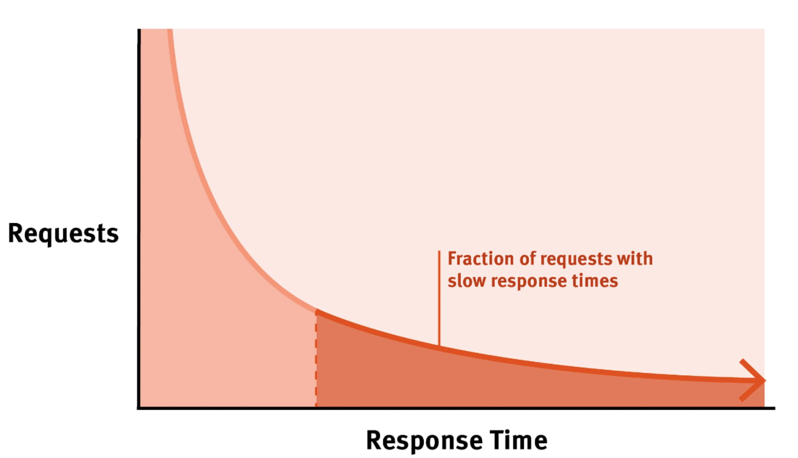

# Performance Measure Metrics

Latency
- Affects - UX
- Desired - As low as possible

Throughput
- Affects - No of users that can be supported
- Desired - Greater than the request rate

Errors
- Affects - Functional correctness
- Desired - None

Resource Saturation
- Affects - Hardware capacity required
- Desired - Efficient utilization of all system resources

## Tail latency

Tail latency is an indication of queuing of requests
- Gets worse with higher workloads

Average latency hides the effects of tail latency
- Also measures 99 (or 99.9) percentile latency
