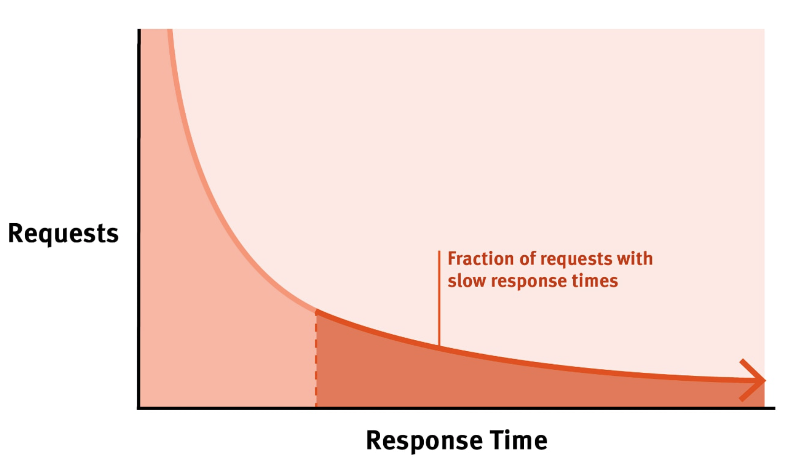

# Performance

Measure of how fast or responsive a system is under
- a given workload
  - backend data
  - request volume
- a given hardware
  - kind
  - capacity

## Performance Problems

How to spot a performance problems? How does it look like?

Every performance problem is the result of some queue building somewhere.
- Network socket
- DB IO queue
- OS run queue

Reasons for queue build up
- Inefficient slow processing
- Serial resource access
- Limited resource capacity

## Principles

Efficiency
- Efficient resource utilization
  - IO = Memory, Network, Disk
  - CPU
- Efficient Logic
  - Algorithms
  - DB Queries
- Efficient Data Storage
  - Data Structures
  - DB Schema
- Caching

Concurrency
- Hardware
- Software
  - Queueing
  - Coherence
- Capacity

## System performance objectives

- Minimize request - response latency
  - Latency is measured in time units
  - Depends on
    - wait / idle time
    - processing time

- Maximize throughput
  - throughput is measured as rate of request
  - Depends on
    - Latency
    - Capacity

## Performance Measure Metrics

Latency
- Affects - UX
- Desired - As low as possible

Throughput
- Affects - No of users that can be supported
- Desired - Greater than the request rate

Errors
- Affects - Functional correctness
- Desired - None

Resource Saturation
- Affects - Hardware capacity required
- Desired - Efficient utilization of all system resources

### Tail latency

Tail latency is an indication of queuing of requests
- Gets worse with higher workloads

Average latency hides the effects of tail latency
- Also measures 99 (or 99.9) percentile latency

## Serial Request Latency
### Network Latency

Sources of latencies
- Data transfer latency
  - Internet
  - Intranet
- TCP connection
- SSL / TLS connection

#### Approaches
1. Persistent connections
2. Data format / compression
3. SSL session caching
4. Static data caching
5. Session / data caching
6. Connection pool (reuse connection in DB)
